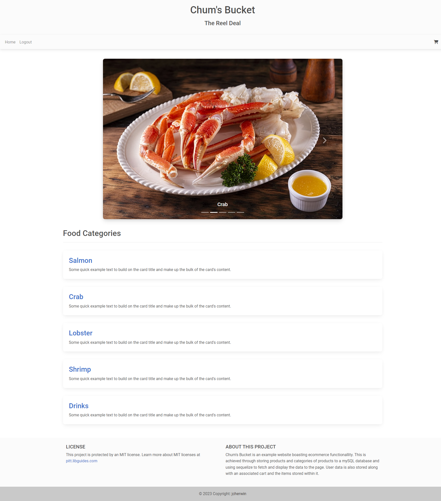

# Chum's Bucket - Restaurant App

## Description

We made Chum's Bucket because we wanted to create a professional E-Commerce platform for a restaurant using what we've learned about the MVC framework.

We wanted to create an application that would allow users to select from a variety of products, view pictures of those products to help them make their selection, and then select those products to be added to their own unique cart (with the condition of already being logged in to application), and then simulate checking out which removes all items from their cart and places an order. These carts are persistent on Chum's Bucket's back-end database, so users can come back and add to or delete from their cart whenever they want. 

Through the course of this project, we learned more about the MVC framework, and how to properly set up models and associations through the Sequelize ORM. We learned more about using Handlebars to programmatically fill in our HTML views, as well as tying in front-end JavaScript to send and get information to/from the back-end. We also learned more about collaborative projects and how to work with a Minimum Viable Product and deadlines in mind.

## User Story
AS a customer who has heard about Chum's Bucket and wants to place an order with them online
- I WANT a website where I can view what kind of food they have
- THEN I can add food to a cart after logging in
- THEN I want to see my subtotal of all my items
- FINALLY I want to checkout and place my order


## Table of Contents

- [Demo](#demo)
- [Installation](#installation)
- [Usage](#usage)
- [Credits](#credits)
- [License](#license)


# Demo

Here is a link to the deployed application being hosted on: [Heroku](https://lit-citadel-42811.herokuapp.com/)

## Installation

This program was built and tested using node.js v16.19.0.

After cloning this repository into a working folder of your own, you'll need to run the following command to pull in the node packages required to run the program.

```md
npm install OR npm i
```

## Usage

<!-- Provide instructions and examples for use. Include screenshots as needed. -->

This image is an example of what to expect when viewing the complete webpage.



Before running the server, you should setup the database schema by running the following commands after logging in through the SQL Client or Docker:

```md
source db/schema.sql
```

Finally, whether you are running this locally or via Heroku deployment, the seeds for categories and products are included when you run the server via the following command:

```md
npm start
```


## Credits

<!-- List your collaborators, if any, with links to their GitHub profiles. -->

**Collaborators**
- [Jon Cherwin](https://github.com/jcherwin)
- [Jullian Calkins]()

<!-- If you used any third-party assets that require attribution, list the creators with links to their primary web presence in this section. -->

**Assets:**
- []()


<!-- If you followed tutorials, include links to those here as well. -->

<!-- **Tutorials:** -->


## License

The source code of this project is licensed with [MIT](LICENSE).
